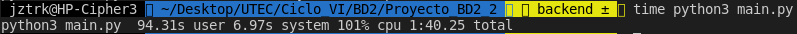
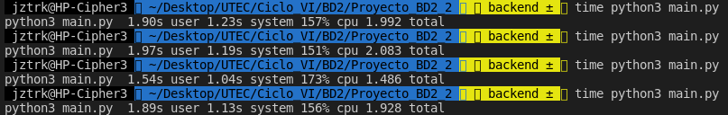
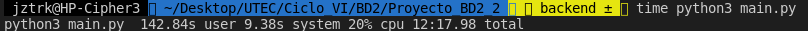

# Proyecto_BD2_2

## ¿Como usar?
Esta es la página principal. La barra del medio le permite buscar una frase en lenguaje natural
en una colección de tweets. Los tweets recuperados estan rankeados con la similitud de coseno.


En la configuración usted podrá definir: la cantidad de tweets máxima que se
van a recuperar y cuantos tweets aparecerán por página. También puede modifcar
la base de datos cambiando el contexto de los tweets (realizado mediante una frase 
de consulta: todos los tweets contendran esa frase) y el número total de tweets que
se guardarán de dicho contexto, en disco.


## Archivos usados en memoria secundaria
- **resources/Data.json:** Colección de máximo size_tweets (el usuario puede modificar este número) tweets que fueron filtrados a través de una frase de consulta en la función change_index_theme

- **resources/indexs:** Carpeta donde se guardan los índices SPIMI locales que serán fusionados en la función merge. Siempre son 20 índices. Al unirlos en el índice final, son eliminados.

- **resources/i_index.json:** Índice Invertido final.

- **resources/index.txt:** Índice para poder ubicarnos en un tweet dada su posición lógica en la colección, ya que la API los guarda en espacios de longitud variable.

- **resources/lengths.json:** Archivo donde se guardan las longitudes de todos los tweets. Es imprescindible para la normalización al momento de realizar la similitud de coseno

- **static/data/rpta.json:** Archivo que contiene los K tweets más relevantes a la consulta del usuario, es decir, es el output de la función do_query.

## Indexación
### Crear el indice (por bloques)

Creamos el indice invertido a base de los datos en data.json 
y guardamos los tokens y sus respectivos pesos DF y TF en un diccionario
de diccionarios. Esto corresponde a un sólo bloque de tweets.

```python
    def __build_inverted_index(self, n, block):
        tw_index = 1
        lengths = {}
        with open("resources/data.json", "r") as file:

            # Partición por bloques
            for j in range(math.ceil(n/block)):
                local_terms = {}

                # Partición por tweets
                for _ in range(block):
                    tweet_data = json.loads(file.readline())
                    tokens = tp.tokenize(tweet_data["content"])
                    lengths[tw_index] = len(tokens)
                    terms = {}
                    # Construye la tupla (cant_palabras, tw_index) para cada termino
                    for token in tokens:
                        if terms.get(token) is None or terms.get(token)[1] != tw_index:
                            terms[token] = (1, tw_index)
                        else:
                            terms[token] = (terms[token][0] + 1, tw_index)
                    # Añadimos la información de este tweet a su índice
                    for term in terms:
                        if local_terms.get(term) is None:
                            local_terms[term] = [(terms[term][0], terms[term][1])]
                        else:
                            local_terms[term].append((terms[term][0], terms[term][1]))
                    tw_index += 1

                # Indice i-ésimo 
                inverted_index = {}
                for word in local_terms:
                    inverted_index[word] = {
                        "DF": len(local_terms[word]),
                        "TF": local_terms[word]
                    }

                # Escritura del i-ésimo índice temporal local
                json_file = open('resources/indexs/i' + str(j) + '.json', 'a', newline='\n', encoding='utf8')
                json_file.truncate(0)
                json_file.write(json.dumps(inverted_index, ensure_ascii=False, default=str))

        # Escritura de las longitudes de los tweets
        lengths_file = open('resources/lengths.json', 'a', newline='\n', encoding='utf8')
        lengths_file.truncate(0)
        lengths_file.write(json.dumps(lengths, ensure_ascii=False, default=str))
        return

```
### Fusión de los índices locales
Recibe los n bloques que fueron convertidos a índices invertidos locales a través
de la función anterior y los mezcla para escribir en un archivo el índice invertido
final.
```python
    def __merge(self):
        inverted_index = {}

        # Lectura de los índices temporales
        for local_index in glob('resources/indexs/*.json'):
            with open(local_index, "r") as index:
                local_dict = json.loads(index.readline())
            
            # Colocamos las frecuencias
            for k in local_dict.keys():
                if k not in inverted_index.keys():
                    inverted_index[k] = local_dict[k]
                else:
                    # Dado que cada tweet se revisa secuencialmente, no hay colisiones en los TF
                    inverted_index[k]['TF'] += (local_dict[k]['TF'])
                    # Se suman las frecuencias de documentos
                    inverted_index[k]['DF'] += (local_dict[k]['DF'])
            os.remove(local_index)

        # Escribimos el índice completo
        json_file = open('resources/i_index.json', 'a', newline='\n', encoding='utf8')
        json_file.truncate(0)
        json_file.write(json.dumps(inverted_index, ensure_ascii=False, default=str))
        return
```

### BSBI
Define el tamaño de las particiones, llama a cada una de ellas a usarse para la construcción
de un índice local y finalmente las fusiona para obtener el índice final en disco.

```python
    def BSBI_builder(self):
        block = int(size_tweets / 20)
        self.__build_inverted_index(size_tweets, block)
        self.__merge()
        return

```
## Procesamiento de la query
### Tokenización

Hacemos uso de la librería nltk, cuya implementación soporta parcialmente consultas 
en el lenguaje español.
De la librería, usamos las funciones encode, decode, stem (Snowball) y tokenize; todas ellas vistas
ya previamente en el curso. Luego, procedemos a deshacernos de los stopwords. La propia
nltk nos proporciona una lista de stopwords que, de acuerdo a sus estudios, es eficiente. Agregramos también
algunos símbolos más, para un mejor filtrado.
Debido a que un tweet no necesariamente se redacta formalmente, la librería nos proporciona un tweet tokenizer. Este
tokenizer preserva, por ejemplo, los hashtags y los usernames. Esto nos permite soportar ese tipo de consultas.

```python
    def tokenize(self, tweet):
        tweet = tweet.encode('ascii', 'ignore').decode('ascii')
        return [
            self.stemmer.stem(t) for t in self.tknzr.tokenize(tweet)
            if t not in stopwords.words('spanish') and
                t not in 
                ["<", ">", ",", "º", ":", ";", ".", "!", "¿", "?", ")", "(", "@", "'",'"','\"', '.', '...', '....']
        ]
```

### Similitud de cosenos

Obtenemos la distancia de coseno de la query y buscamos sus
términos en el índice para hacer lo mismo con los tweets
que contienen las palabras de la query. Además del índice, usamos el archivo
lengths.json, el cual contiene los tamaños de los tweets, que
fueron guardados en disco al crear los índices locales.
Gracias a ello es posible normalizar los tweets.

```python
    # Calculamos la distancia de coseno:
    for q in query_words:
        if i_dic.get(q) is not None:
            i = i_dic[q]
            idf = math.log10(n/i['DF'])
            # Normalizamos localmente el vector de palabras en el query
            qq = (1 + math.log10(query_words[q])) * idf / qnorm
            for tweet in i['TF']:
                # Sumamos a un documento el puntaje que va consiguiendo (con dist. de coseno)
                tf = 1 + math.log10(tweet[0])
                ii = tf * idf / lengths[str(tweet[1])]
                cosine = round(ii * qq, 4)
                if tweets.get(tweet[1]) is None:
                    tweets[tweet[1]] = cosine
                else:
                    tweets[tweet[1]] += cosine
    heap = []

    # Debemos hacer una segunda pasada porque los cosenos podrían haberse modificado...
    for tweet in tweets:
        heappush(heap, (-1 * tweets[tweet], tweet))

```
### Filtrar los k mejores tweets
Después de procesar la query y calcular la similitud de coseno con respecto
a los tweets de la colección, se filtran los k mejores tweets haciendo uso
de un max heap con la distancia de coseno.

```python
def process_query(query, k, n):
    tokens = tp.tokenize(query)
    qnorm = len(tokens)

    # Obtenemos la frecuencia de las palabras en la query
    query_words = {}
    for q in tokens:
        if query_words.get(q) is None:
            query_words[q] = 1
        else:
            query_words[q] += 1

    # Leemos el index desde un archivo (memoria secundaria)
    tweets = {}
    with open('resources/i_index.json', "r") as index:
        i_dic = json.loads(index.readline())
    with open('resources/lengths.json', "r") as lens:
        lengths = json.loads(lens.readline())

    # Calculamos la distancia de coseno:
    for q in query_words:
        if i_dic.get(q) is not None:
            i = i_dic[q]
            idf = math.log10(n/i['DF'])
            # Normalizamos localmente el vector de palabras en el query
            qq = (1 + math.log10(query_words[q])) * idf / qnorm
            for tweet in i['TF']:
                # Sumamos a un documento el puntaje que va consiguiendo (con dist. de coseno)
                tf = 1 + math.log10(tweet[0])
                ii = tf * idf / lengths[str(tweet[1])]
                cosine = round(ii * qq, 4)
                if tweets.get(tweet[1]) is None:
                    tweets[tweet[1]] = cosine
                else:
                    tweets[tweet[1]] += cosine
    heap = []

    # Debemos hacer una segunda pasada porque los cosenos podrían haberse modificado...
    for tweet in tweets:
        heappush(heap, (-1 * tweets[tweet], tweet))

    # Uso de fila de prioridades para el ranking
    retrieved = {}
    for i in range(min(k, len(tweets))):
        retrieved[heap[0][1]] = -1 * heap[0][0]
        heappop(heap)
        heapify(heap)
    return retrieved

```

## Benchmarks

Considerando la suma de los tiempos de user y system, se obtuvieron los siguientes resultados:

### Build index benchmark
Este es el tiempo de creación del indice invertido (1ms 40s 25ms).

### Queries benchmark
Estos son los tiempos que nos tomó encontrar las siguientes busquedas (k=10):
1. Cristiano Ronaldo (1s 99ms).
2. Toni Kroos (2s 08ms).
3. Sheriff (1s 48ms).
4. Manchester City (1s 92ms).

Considerar que para esta consulta se filtraron los 10 mejores tweets.

### Change index benchmark
Este es el tiempo que toma el cambiar el contexto de los tweets (12m 17s 98ms).

